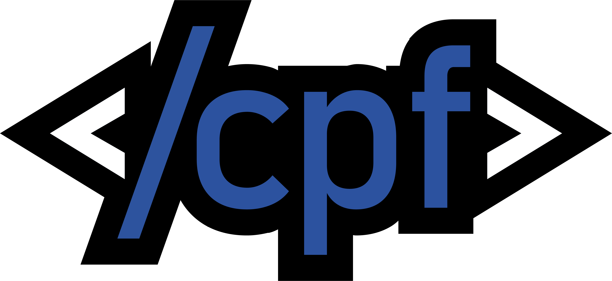

# Club de Programación FIUNA - Sitio Web Oficial

<div align="center">
  
  <p><em>Sitio web oficial del Club de Programación de la Facultad de Ingeniería de la Universidad Nacional de Asunción</em></p>
</div>

## 📋 Estado Actual

El sitio web está en desarrollo activo. Las características principales están implementadas, pero algunas secciones aún necesitan contenido real y conexión con servicios backend.

### ✅ Completado
- Diseño y estructura principal del sitio
- Páginas principales (Inicio, Acerca de, Eventos, Proyectos, Recursos, Blog, Contacto)
- Soporte para temas claro/oscuro
- Diseño responsivo para todos los dispositivos
- Sistema de visualización de contenido markdown
- Animaciones y efectos visuales
- Conexión de formularios a endpoints backend
- Reemplazo de contenido de muestra con datos reales

### 🚧 En Progreso
- Implementación de sistema de autenticación
- Integración con sistema CMS para administración de contenido
- Optimización de rendimiento y accesibilidad

## 🛠️ Tecnologías Utilizadas

El sitio está construido con tecnologías modernas de desarrollo web:

- **React 18**: Biblioteca para construir interfaces de usuario
- **TypeScript**: Superset de JavaScript tipado
- **Vite**: Herramienta de compilación ultrarrápida
- **React Router**: Enrutamiento para aplicaciones React
- **Tailwind CSS**: Framework CSS utilitario para diseño responsivo
- **Shadcn/UI**: Componentes de interfaz de usuario reutilizables
- **Framer Motion**: Biblioteca para animaciones
- **React Query**: Manejo del estado de datos
- **Lucide**: Biblioteca de iconos SVG
- **Recharts**: Biblioteca para visualización de datos

## 🏗️ Estructura del Proyecto

```
src/
  ├── components/        # Componentes reutilizables
  │   ├── ui/            # Componentes de interfaz básicos
  │   ├── layout/        # Componentes de estructura (Header, Footer)
  │   ├── home/          # Componentes específicos de la página principal
  │   ├── blog/          # Componentes para el blog
  │   ├── events/        # Componentes para eventos
  │   ├── projects/      # Componentes para proyectos
  │   ├── resources/     # Componentes para recursos
  │   ├── about/         # Componentes para la página acerca de
  │   ├── logros/        # Componentes para la página de logros
  │   ├── contact/       # Componentes para la página de contacto
  │   └── ...
  ├── content/           # Contenido en formato markdown
  │   ├── blog/          # Artículos del blog
  │   ├── events/        # Información de eventos
  │   ├── projects/      # Información de proyectos
  │   └── courses/       # Información de cursos
  ├── context/           # Contextos de React
  ├── hooks/             # Hooks personalizados
  ├── lib/               # Utilidades y funciones auxiliares
  ├── pages/             # Componentes de página
  ├── styles/            # Estilos globales
  ├── utils/             # Funciones de utilidad
  ├── App.tsx            # Componente principal
  └── main.tsx           # Punto de entrada
```

## 📝 Características Principales

- **Diseño Responsivo**: Adaptable a todos los tamaños de pantalla
- **Tema Claro/Oscuro**: Sistema de temas basado en preferencias del usuario
- **Animaciones**: Transiciones y efectos visuales fluidos
- **Contenido Markdown**: Sistema para mostrar contenido estructurado
- **Rendimiento**: Optimización de carga y renderizado
- **Accesibilidad**: Enfoque en hacer el sitio accesible para todos

## 🚀 Cómo Ejecutar Localmente

1. Clona este repositorio
   ```bash
   git clone https://github.com/cpfiuna/website.git
   cd website
   ```

2. Instala las dependencias
   ```bash
   npm install
   ```

3. Inicia el servidor de desarrollo
   ```bash
   npm run dev
   ```

4. Abre [http://localhost:5173](http://localhost:5173) en tu navegador

## 📦 Compilación para Producción

```bash
npm run build
```

## 🤝 Cómo Contribuir

Agradecemos las contribuciones de todos los miembros del club y la comunidad.

1. Haz un fork del repositorio
2. Crea una rama para tu feature (`git checkout -b feature/amazing-feature`)
3. Realiza tus cambios y haz commit (`git commit -m 'Add some amazing feature'`)
4. Envía tus cambios (`git push origin feature/amazing-feature`)
5. Abre un Pull Request

Para más detalles, consulta el archivo [CONTRIBUTING.md](CONTRIBUTING.md).

## 📄 Licencia

Este proyecto está bajo la licencia MIT. Ver el archivo [LICENSE](LICENSE) para más detalles.

## 📞 Contacto

Para consultas sobre el sitio web o el Club de Programación FIUNA, por favor contacta a través de:
- Email: [club.programacion@ing.una.py](mailto:club.programacion@ing.una.py)
- Discord: [Servidor del Club de Programación FIUNA](https://discord.gg/clubprogramacionfiuna)
- GitHub: [github.com/cpfiuna](https://github.com/cpfiuna)

---

Desarrollado con ❤️ por miembros del Club de Programación FIUNA
