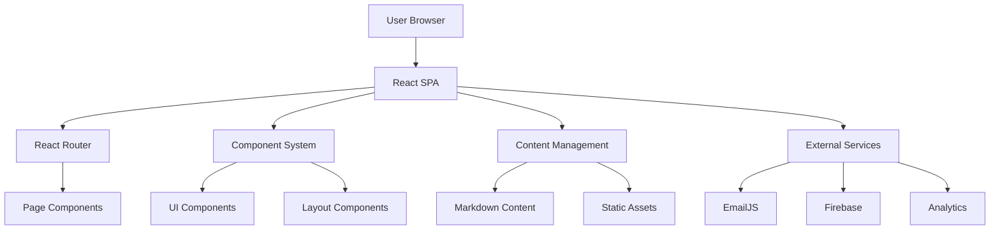

# CPF Website Architecture

## System Overview

The CPF Website is built as a modern React-based single-page application (SPA) with a focus on performance, maintainability, and user experience.

## High-Level Architecture



## Core Principles

### 1. Component-Based Architecture

- **Atomic Design** - Components organized from basic atoms to complex organisms
- **Reusability** - Shared components across different pages
- **Composability** - Complex UIs built from simple, composable pieces

### 2. Content-First Approach

- **Markdown Content** - Easy-to-edit content files
- **Separation of Concerns** - Content separated from presentation
- **Version Control** - Content changes tracked in Git

### 3. Performance Optimization

- **Code Splitting** - Lazy loading of route components
- **Image Optimization** - Responsive images with proper formats
- **Bundle Optimization** - Tree shaking and minimal dependencies

## Directory Structure Deep Dive

### `/src/components/`

```
components/
├── common/             # Shared utilities
│   ├── SEO.tsx        # SEO meta tags
│   ├── LoadingSpinner.tsx
│   └── ErrorBoundary.tsx
├── layout/            # Layout structure
│   ├── Header.tsx
│   ├── Footer.tsx
│   ├── Navigation.tsx
│   └── Layout.tsx
├── sections/          # Page sections
│   ├── Hero.tsx
│   ├── About.tsx
│   ├── Projects.tsx
│   ├── Events.tsx
│   └── Contact.tsx
└── ui/               # Basic UI elements
    ├── Button.tsx
    ├── Card.tsx
    ├── Modal.tsx
    └── Form/
```

### `/src/pages/`

```
pages/
├── Home.tsx          # Landing page
├── About.tsx         # About CPF
├── Projects.tsx      # Projects showcase
├── Events.tsx        # Events and news
├── Documentation.tsx # Documentation hub
├── Contact.tsx       # Contact information
└── NotFound.tsx      # 404 page
```

### `/src/content/`

```
content/
├── about/           # About page content
├── projects/        # Project descriptions
├── events/          # Event information
├── docs/           # Documentation content
└── docs-projects/  # Multi-project docs
```

## State Management

### Local State

- **React Hooks** - useState, useEffect for component state
- **Custom Hooks** - Reusable stateful logic
- **Context API** - Shared state when needed

### External State

- **URL State** - Router state for navigation
- **Form State** - Controlled components for forms
- **Cache State** - Browser storage for performance

## Styling Strategy

### Tailwind CSS

```tsx
// Utility-first approach
<div className="bg-blue-600 text-white px-4 py-2 rounded-lg hover:bg-blue-700 transition-colors">
  Button
</div>
```

### Component Styling

```tsx
// Styled component pattern
const StyledButton = styled.button`
  ${tw`bg-blue-600 text-white px-4 py-2 rounded-lg`}
  
  &:hover {
    ${tw`bg-blue-700`}
  }
`;
```

### Design System

- **Colors** - Consistent color palette
- **Typography** - Defined text scales
- **Spacing** - Consistent spacing units
- **Components** - Reusable design patterns

## Routing Architecture

### React Router Setup

```tsx
<BrowserRouter>
  <Routes>
    <Route path="/" element={<Layout />}>
      <Route index element={<Home />} />
      <Route path="about" element={<About />} />
      <Route path="projects" element={<Projects />} />
      <Route path="events" element={<Events />} />
      <Route path="documentacion/*" element={<Documentation />} />
      <Route path="contact" element={<Contact />} />
      <Route path="*" element={<NotFound />} />
    </Route>
  </Routes>
</BrowserRouter>
```

### Documentation Routing

```tsx
// Nested routing for documentation
<Routes>
  <Route index element={<ProjectsDocsHub />} />
  <Route path="projects/:projectId/*" element={<ProjectDocumentationPage />} />
  <Route path="legacy/*" element={<LegacyDocs />} />
</Routes>
```

## Content Management System

### Markdown Processing

```tsx
// Content loading
const loadMarkdownContent = async (path: string) => {
  const response = await fetch(`/content/${path}.md`);
  const content = await response.text();
  return markdownToHtml(content);
};
```

### Content Types

```typescript
interface ProjectDoc {
  id: string;
  title: string;
  description: string;
  content: string;
  lastModified: Date;
  tags: string[];
}
```

## Performance Considerations

### Code Splitting

```tsx
// Lazy loading components
const Projects = lazy(() => import('./pages/Projects'));
const Documentation = lazy(() => import('./pages/Documentation'));
```

### Image Optimization

```tsx
// Responsive images
<picture>
  <source srcSet="image.webp" type="image/webp" />
  
</picture>
```

### Bundle Analysis

```bash
# Analyze bundle size
npm run build
npm run analyze
```

## Security Considerations

### Content Security Policy

```html
<meta http-equiv="Content-Security-Policy" 
      content="default-src 'self'; script-src 'self' 'unsafe-inline';">
```

### Input Sanitization

```tsx
// Sanitize user input
import DOMPurify from 'dompurify';

const sanitizedContent = DOMPurify.sanitize(userInput);
```

## Integration Points

### External Services

- **EmailJS** - Contact form submissions
- **Firebase** - Authentication and hosting
- **Google Analytics** - Usage tracking
- **CDN** - Static asset delivery

### API Integration

```tsx
// Service layer
class ApiService {
  static async sendContactMessage(data: ContactFormData) {
    return emailjs.send(
      process.env.REACT_APP_EMAILJS_SERVICE_ID!,
      process.env.REACT_APP_EMAILJS_TEMPLATE_ID!,
      data,
      process.env.REACT_APP_EMAILJS_PUBLIC_KEY!
    );
  }
}
```

## Testing Strategy

### Unit Testing

```tsx
// Component testing
describe('Button Component', () => {
  it('renders correctly', () => {
    render(<Button>Click me</Button>);
    expect(screen.getByRole('button')).toBeInTheDocument();
  });
});
```

### Integration Testing

```tsx
// Page testing
describe('Home Page', () => {
  it('displays hero section', () => {
    render(<Home />);
    expect(screen.getByTestId('hero-section')).toBeInTheDocument();
  });
});
```

## Deployment Architecture

### Build Process

```bash
# Production build
npm run build

# Static files generated in /build
# Ready for deployment to static hosting
```

### Hosting Options

- **Vercel** - Recommended for React apps
- **Netlify** - Alternative static hosting
- **Firebase Hosting** - Google's hosting solution
- **GitHub Pages** - Free option for open source

## Monitoring and Analytics

### Performance Monitoring

```tsx
// Web Vitals tracking
import { getCLS, getFID, getFCP, getLCP, getTTFB } from 'web-vitals';

getCLS(console.log);
getFID(console.log);
getFCP(console.log);
getLCP(console.log);
getTTFB(console.log);
```

### Error Tracking

```tsx
// Error boundary implementation
class ErrorBoundary extends React.Component {
  componentDidCatch(error: Error, errorInfo: ErrorInfo) {
    // Log error to monitoring service
    console.error('Error caught by boundary:', error, errorInfo);
  }
}
```

## Future Considerations

### Scalability

- **Micro-frontends** - For large-scale applications
- **Server-Side Rendering** - For improved SEO
- **Progressive Web App** - For mobile experience

### Technology Upgrades

- **React 18 Features** - Concurrent rendering
- **New Build Tools** - Vite for faster builds
- **Modern CSS** - Container queries, CSS Grid improvements
